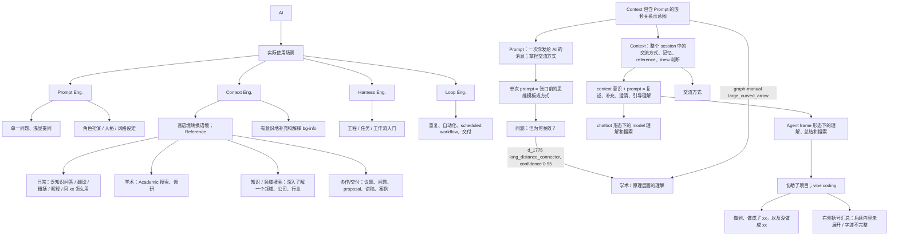

> 注：本报告基于旧版默认参数（纵向切片、200 DPI、5% 重叠）生成。当前 gn2graph 已改为默认横向切片（`left_to_right_*.jpg`）、300 DPI、10% 重叠，并默认附带原 PDF 与可搜索文本。下文保留原始识别内容作为历史参考。

# GoodNotes 白板识别报告

## 忠实转写

证据来源：

- `prompt.md`：要求保留显式 graph edge，尤其是 `问题：但为何奏效？ -> 学术 / 原理层面的理解`。
- `graph-manual.json`：当前可用结构化输出，包含 29 个节点、27 条边。
- `goodnotes-whiteboard-test-materials/tiles/metadata.json`：当前程序输出为 3 张 tile，画布尺寸 `10970 x 4373`，tile 高度 2000px，重叠 100px。
- 当前目录未发现 `graph.json`、`manifest.json`、`overview.png`、`recognition_tasks/page_XXX.json`。

白板主干是“AI -> 实际使用场景”。“实际使用场景”用括号分成四类：

- `Prompt Eng.`
  - `单一问题、浅显提问`
  - `角色扮演 / 人格 / 风格设定`
- `Context Eng.`
  - `高语境转换语境；Reference`
  - `有意识地补充和解释 bg-info`
- `Harness Eng.`
  - `工程 / 任务 / 工作流入门`，部分字迹不确定
- `Loop Eng.`
  - `重复、自动化、scheduled workflow、交付`

`高语境转换语境；Reference` 右侧有一组使用场景：

- `日常：泛知识问答 / 翻译 / 概括 / 解释 / 问 xx 怎么用`
- `学术：Academic 搜索、调研`
- `知识 / 领域搜索：深入了解一个领域、公司、行业`
- `协作/交付：议题、问题、proposal、讲稿、案例`，部分字迹不确定

白板中部偏右画了一个嵌套图：`Prompt` 在 `Context` 内部。旁边说明：

- `Prompt`：一次你发给 AI 的消息；拿捏你与 AI 的交流方式。
- `Context`：整个 session 中的交流方式；对 model 的记忆和 reference 的了解；对 `/new` 的时机与理由的判断与思考。
- `单次 prompt = 张口前的思维模板或方式`
- `综合 context 意识 + prompt = 复述语 + 理解自己要补充什么给 AI + 在全程交流中明确聊到哪里，并引导 AI 思考、补充、澄清表述信息、仔细理解`

右侧继续区分两种 model 理解：

- `对 model 在 chatbot 形态下自己的理解和搜索（对经验资料和学界研究的了解）`
- `对 model 在 Agent frame 形态下的理解、总结和搜索 -> 协助了项目；vibe coding`
- `协助了项目；vibe coding -> 做到、做成了 xx，以及没做成 xx`

`prompt.md` 中要求保留的长距离连接是：

- `问题：但为何奏效？ -> 学术 / 原理层面的理解`，edge id `d_1775`，类型 `long_distance_connector`，confidence `0.95`

当前 `graph-manual.json` 中另有一条近似长弧关系：

- `Context 包含 Prompt 的嵌套关系示意图 -> 学术 / 原理层面的理解`

这两条证据方向不完全一致，不能合并成一句概括。按 `prompt.md` 的证据优先级，报告中同时保留两条。

## 结构关系

### prompt.md 显式要求保留

- `问题：但为何奏效？ -> 学术 / 原理层面的理解`，via `d_1775`，`long_distance_connector`，confidence `0.95`

### graph-manual.json 边

- `AI -> 实际使用场景`
- `实际使用场景 -> Prompt Eng.`
- `实际使用场景 -> Context Eng.`
- `实际使用场景 -> Harness Eng.`
- `实际使用场景 -> Loop Eng.`
- `Prompt Eng. -> 单一问题、浅显提问`
- `Prompt Eng. -> 角色扮演 / 人格 / 风格设定`
- `Context Eng. -> 高语境转换语境；Reference`
- `Context Eng. -> 有意识地补充和解释 bg-info`
- `Harness Eng. -> 工程 / 任务 / 工作流入门（部分字迹不确定）`
- `Loop Eng. -> 重复、自动化、scheduled workflow、交付`
- `高语境转换语境；Reference -> 日常：泛知识问答 / 翻译 / 概括 / 解释 / 问 xx 怎么用`
- `高语境转换语境；Reference -> 学术：Academic 搜索、调研`
- `高语境转换语境；Reference -> 知识 / 领域搜索：深入了解一个领域、公司、行业`
- `高语境转换语境；Reference -> 协作/交付：议题、问题、proposal、讲稿、案例（部分字迹不确定）`
- `Context 包含 Prompt 的嵌套关系示意图 -> Prompt：一次你发给 AI 的消息；拿捏你与 AI 的交流方式`
- `Context 包含 Prompt 的嵌套关系示意图 -> Context：整个 session 中的交流方式；对 model 的记忆和 reference 的了解；对 new 时机与理由的判断与思考`
- `Prompt：一次你发给 AI 的消息；拿捏你与 AI 的交流方式 -> 单次 prompt = 张口前的思维模板或方式`
- `Context：整个 session 中的交流方式；对 model 的记忆和 reference 的了解；对 new 时机与理由的判断与思考 -> 综合 context 意识 + prompt = 复述语 + 理解自己要补充什么给 AI + 在全程交流中明确聊到哪里，并引导 AI 思考、补充、澄清表述信息、仔细理解`
- `Context：整个 session 中的交流方式；对 model 的记忆和 reference 的了解；对 new 时机与理由的判断与思考 -> 交流方式`
- `单次 prompt = 张口前的思维模板或方式 -> 但为何奏效？`
- `综合 context 意识 + prompt = 复述语 + 理解自己要补充什么给 AI + 在全程交流中明确聊到哪里，并引导 AI 思考、补充、澄清表述信息、仔细理解 -> 对 model 在 chatbot 形态下自己的理解和搜索（对经验资料和学界研究的了解）`
- `综合 context 意识 + prompt = 复述语 + 理解自己要补充什么给 AI + 在全程交流中明确聊到哪里，并引导 AI 思考、补充、澄清表述信息、仔细理解 -> 对 model 在 Agent frame 形态下的理解、总结和搜索`
- `对 model 在 Agent frame 形态下的理解、总结和搜索 -> 协助了项目；vibe coding`
- `协助了项目；vibe coding -> 做到、做成了 xx，以及没做成 xx`
- `协助了项目；vibe coding -> 右侧括号汇总：后续内容未展开 / 字迹不完整`
- `Context 包含 Prompt 的嵌套关系示意图 -> 学术 / 原理层面的理解`

## 整理版

这张白板讨论的是 AI 使用能力如何从简单 prompt 走向更稳定的 context 和 agent 工作流。

第一层是实际使用场景。`Prompt Eng.` 对应一次性提问、角色扮演和风格设定。`Context Eng.` 不只是写一个 prompt，而是把背景、reference、语境转换和必要补充放进交流中。`Harness Eng.` 偏向把 AI 接入工程、任务和工作流。`Loop Eng.` 进一步走向重复、自动化和 scheduled workflow。

第二层是 context 与 prompt 的关系。图中把 `Prompt` 画在 `Context` 里面，表示单次 prompt 只是整体交流语境的一部分。`Prompt` 更像“张口前的思维模板或方式”；`Context` 则包括整个 session 的交流方式、model 记忆、reference 理解，以及什么时候 `/new` 的判断。

第三层是为什么这些方法奏效。`prompt.md` 明确要求保留的长距离连接是 `问题：但为何奏效？ -> 学术 / 原理层面的理解`。这说明白板作者认为 prompt/context 技巧背后需要回到学术或原理层面的解释，而不是只停留在技巧列表。

第四层是 agent 形态。白板把 chatbot 形态下的 model 理解，与 Agent frame 形态下的理解、总结和搜索区分开。Agent frame 的方向连接到“协助了项目”和 `vibe coding`，并进一步追踪“做到、做成了什么，以及没做成什么”。

## Mermaid

## 不确定处

- 当前目录没有 `graph.json`，因此使用 `graph-manual.json` 作为当前结构化证据。
- 当前目录没有 `manifest.json`、`overview.png`、`recognition_tasks/page_XXX.json`、`text_blocks.schema.json`，无法完全按 `prompt.md` 的理想读取顺序执行。
- `prompt.md` 指定的 edge 是 `问题：但为何奏效？ -> 学术 / 原理层面的理解`；`graph-manual.json` 记录的是 `Context 包含 Prompt 的嵌套关系示意图 -> 学术 / 原理层面的理解`。两者都被保留，作为证据冲突或证据粒度差异处理。
- `工程 / 任务 / 工作流入门` 后半部分字迹不够清晰。
- `协作/交付：议题、问题、proposal、讲稿、案例` 一行的部分中文词不够清晰。
- `右侧括号汇总` 后续内容未展开，无法确认完整含义。
- `bbox` 来自 `graph-manual.json` 的整图像素坐标，不是 `prompt.md` 所说的 PDF page points 坐标。
